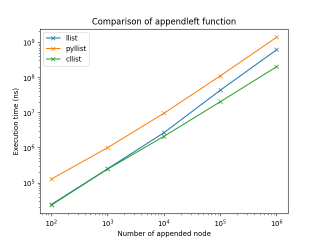
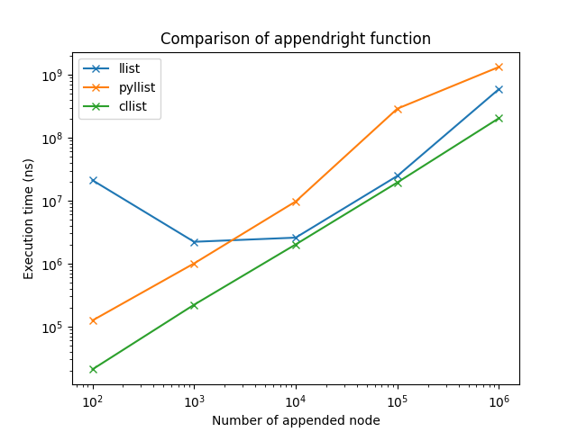
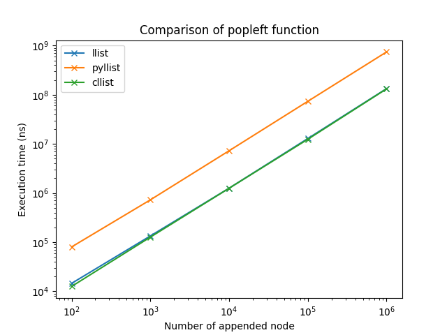
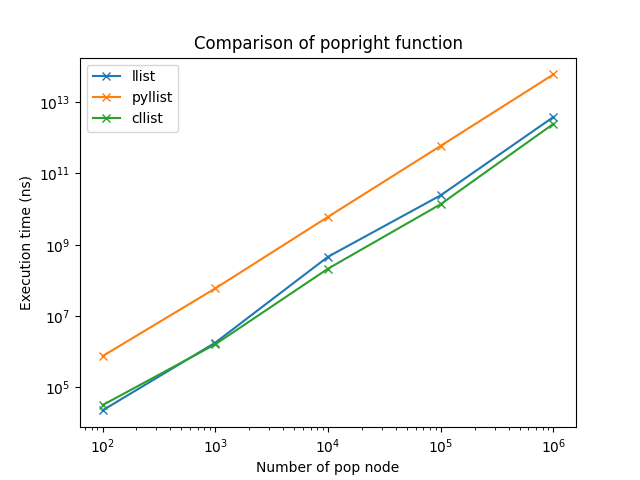
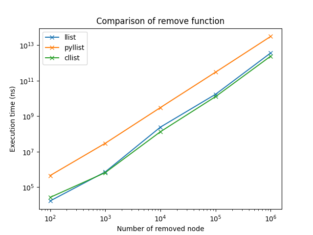

# Performance Evaluation of Python modules: `llist`, `pyllist` and `cclist` 

> TL;DR: `cllist` module presents the best performance.

<!--more-->

When I searched Python modules of linked list from `pip`, I got three avaialble modules: `llist`, `pyllist` and `cllist`. 

Description of `llist`:

>[llist is an extension module for CPython providing basic linked list data structures.](https://github.com/ajakubek/python-llist)

Description of `pyllist`:

> [pyllist is a Python module providing basic linked list data structures.](https://github.com/rgsoda/pypy-llist)

Description of `cllist`:

> [cllist is an extension module for CPython providing basic linked list data structures.](https://github.com/kata198/python-cllist)

Since `llist` and `cllist` use CPython to implmement the linked list, I expect the speed of these two modules is faster than the `pyllist` module. Meanwhile, I want to know which module is the fastest one and quantify the difference of performance.

In the following content, I'll test the speed of five most common functions of **singly** linked list: `appendleft`, `appendright`, `popleft`, `popright` and `remove`. You can check the source code by [clickhere](https://github.com/xwu64/compare_python_llist_module/blob/master/compare_llist_lib.py). Please feel free to reproduce these tests.

**Hardware**:

* CPU: Intel(R) Xeon(R) CPU E5-2660 v3 @ 2.60GHz 
* Memory: 64 GB

**Software**: 

* Operating System: Ubuntu 16.04.6 LTS
* Python: Python 3.8.3
* cllist==1.1.0
* llist==0.6
* matplotlib==3.3.1
* numpy==1.19.1
* pyllist==0.3

## `appendleft`

The `appendleft` function appends one list node to the head of linked list. We test the execution time of appending 100, 1000, 10K, 100K and 1M times consecutively. The execution time is shown below. 

**Observation**:

* `pyllist` presents the worst performance
* `cllist` always presents the better performance than `llist`

## `appendright`

The `appendright` function appends one list node to the tail of linked list. We test the execution time of appending 100, 1000, 10K, 100K and 1M times consecutively. The execution time is shown below. 

**Observation**:

* The speed of `appendright ` is `cllist` > `llist` > `pyllist`
* The execution time from`llist` is high and weird when 100 ~ 1000 nodes are appended to the tail. I repeat test several times. It always gives me the same phenonmenon. Because I don't go through their source code, I don't know the reasone about it.

## `popleft`

The `popleft` function removes the head node of linked list. We test the execution time of removing 100, 1000, 10K, 100K and 1M times consecutively. The execution time is shown below. 

**Observation**:

* The speed of `pyllist` presents the worst performance
* `llist` and `cllist` present the similar performance

## `popright`

The `popright` function removes the tail node of linked list. We test the execution time of removing 100, 1000, 10K, 100K and 1M times consecutively. The execution time is shown below. 

**Observation**:

* `popright` is much more expensive than the previous operations.
* The speed of `popright` is still `cllist` > `llist` > `pyllist` .

## `remove`

The `remove` function remotes the given node from linked list. We test the execution time of removing 100, 1000, 10K, 100K and 1M times consecutively. The given node in every "remove" operation is selected randomly from the linked list. The execution time is shown below. 

**Observation**:

* `remove` operation has the similar cost as the `popright` operation.
* The speed of `popright` is still `cllist` > `llist` > `pyllist` .